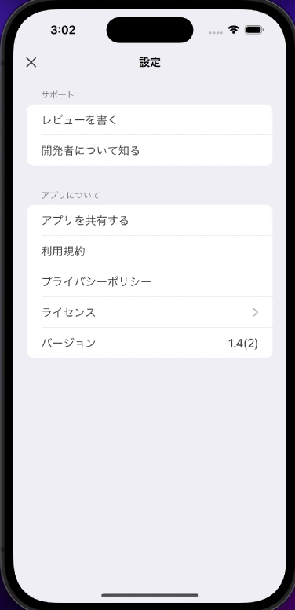

# AppInfoList

Display support and application information on the settings screen View.
Non-licensed cells, when tapped, will transition to the default browser and open the page with the set URL.
This library uses [LicenseList](https://github.com/cybozu/LicenseList) by cybozu. Thank you for your wonderful library!



This GIF was taken using a simulator, so you can't see the app store page when the "write a review" button was tapped.

## License Type

- MIT License

## Development

- Swift 5
- Xcode 14.2

## Installing

### Requirements

- iOS 16.0 or later

### Procedure

1. Install AppInfoList to your project
   1. File → Add Packages...
   2. Enter `https://github.com/kamimi01/AppInfoList.git`
2. Setup for LicenseList
   - see [this blog](https://blog.cybozu.io/entry/2022/07/05/173000)

## How to Use in your code

Minimum

```swift
let info = AppInfo(
    termOfUseURL: URL(string: "https://kamimi01.github.io/PomodoroCounter/privacy_policy/ja.html")!,
    appURL: URL(string: "https://apps.apple.com/jp/app/ez-pomo/id1668609447?l=ja")!,
    developerInfoURL: URL(string: "https://twitter.com/kamimi_01")!,
    appStoreID: "1668609447"
)

AppInfoListView(
    info: info,
    licenseFileURL: Bundle.main.url(forResource: "license-list", withExtension: "plist")!
)
```

You can change text colors and titles in cells with `AppInfoAppearance`.

```swift
let appearance = AppInfoAppearance(
    cellTextColor: .red,
    versionTextColor: .green,
)

AppInfoListView(
    appearance: appearance,
    ・・・
)
```

```swift
let appearance = AppInfoAppearance(
    cellTitles: CellTitles(
        termsOfUse: "Terms of Use"
    )
)

AppInfoListView(
    appearance: appearance,
    ・・・
)
```

If you don't want to display a cell, don't need to pass URL to `AppInfo`
